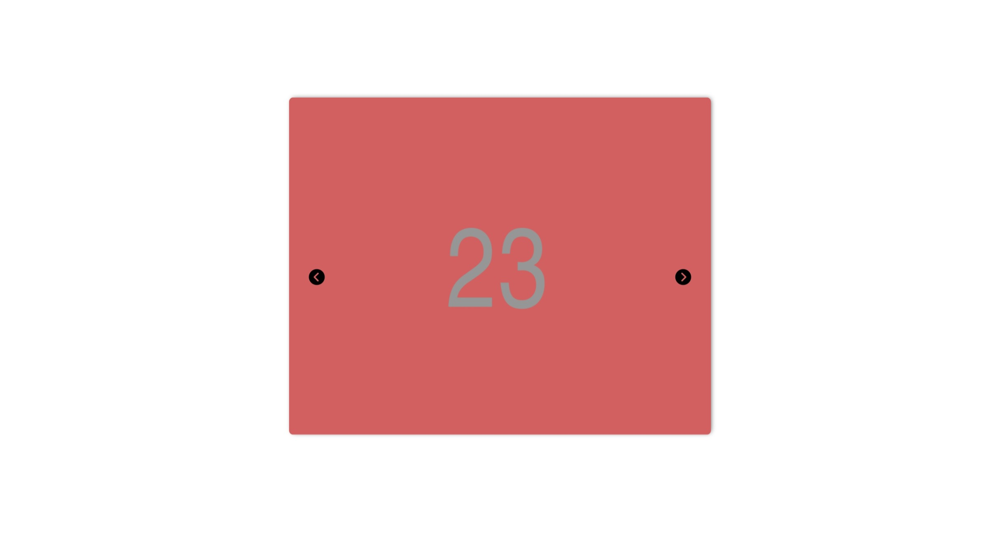

# DCP Coding Challenge Submission

## For a live version of the site please visit: [https://dcp-challenge-aaron-buachie.netlify.app/](https://dcp-challenge-aaron-buachie.netlify.app/)

Users should be able to:

- View the optimal layout for the app depending on their device's screen size.
- Be able to navigate the carousel using the keyboard.
- Have access to descriptions of all images and both navigation buttons while using a screen reader.

### Screenshot

### Links

- Live Site: [https://dcp-challenge-aaron-buachie.netlify.app/](https://dcp-challenge-aaron-buachie.netlify.app/)

### Built with

- Semantic HTML5 markup
- ReactJS Library
- [React Icons](https://react-icons.github.io/react-icons)

# Getting Started with Create React App

This project was bootstrapped with [Create React App](https://github.com/facebook/create-react-app).

## Available Scripts

In the project directory, you can run:

### `yarn start`

Runs the app in the development mode.\
Open [http://localhost:3000](http://localhost:3000) to view it in the browser.

The page will reload if you make edits.\
You will also see any lint errors in the console.

### `yarn test`

Launches the test runner in the interactive watch mode.\
See the section about [running tests](https://facebook.github.io/create-react-app/docs/running-tests) for more information.

### `yarn build`

Builds the app for production to the `build` folder.\
It correctly bundles React in production mode and optimizes the build for the best performance.

The build is minified and the filenames include the hashes.\
Your app is ready to be deployed!

See the section about [deployment](https://facebook.github.io/create-react-app/docs/deployment) for more information.
